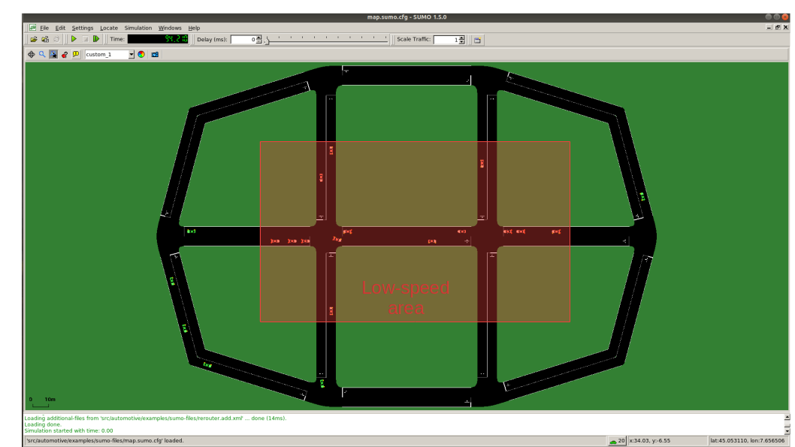
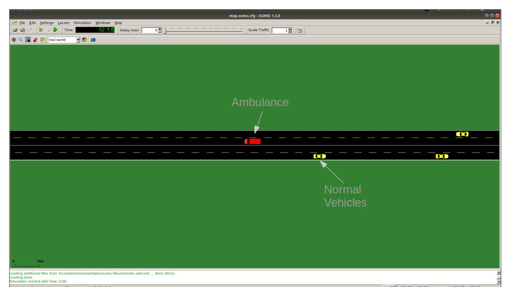

# v2v-framework

ns3 modules to build a simple V2V application using SUMO (v-1.5.0) and ns-3 (v-3.29).

It has been tested with SUMO v1.2.0 and ns3 v3.29 on Ubuntu 18.04.
Back compatibility **is not** ensured with new versions of TraCI.

To build the project:
* Install SUMO following the guide at [https://sumo.dlr.de/wiki/Downloads](https://sumo.dlr.de/wiki/Downloads)
    * You can use 
    	`sudo add-apt-repository ppa:sumo/stable`  
    	`sudo apt update`  
    	`sudo apt install sumo sumo-tools sumo-doc`  
    * Be careful: in the future the previous commands will install updated version of SUMO which are not ensured to work with this scripts (that are tested with **v-1.5.0**)

* Clone this repository in your pc.
    
* Configure waf to build the new modules with "<ns3-folder>./waf configure --build-profile=optimized --enable-examples --enable-tests" (add here what you want to enable) - The usage of the optimized profile allows to speed up the simulation time

* Build ns3

**Important**
The final project path-tree should be like:

    automotive/
               doc/
               examples/
                        sumo-files/
               helper/
               model/
                    asn1/
               test/
    traci/
          doc/
          examples/
          model/
    traci-applications/
                       examples/
                       helper/
                       model/

automotive/ contains all the application related files. Inside sumo-files you can find the SUMO map, trace and and other sumo-related stuff.
traci/ and traci-applications/ contains all the logic to link ns-3 and SUMO.

**Simple V2V example**

To run the program:

`./waf --run "v2v-cv2x"` or
`./waf --run "v2v-80211p"`

*  Nodes are created in the ns3 simulation as vehicle enters the SUMO simulation
*  A full cv2x or 802.11p stack is implemented at lower layers

In this example, every vehicle that enters the scenario will start sending CAM (in plain text) with freq 10 hz. The vehicles are divided into "passenger" vehicles (i.e., normal vehicles) and "emergency" vehicles. When an emergency vehicle enters the scenario, beside the CAMs it starts broadcasting (with frequency 2Hz) DENMs messages containing information related to the edge that it is crossing, and its actual position. The vehicles around will receive them and, in case they are on its way, they decelerate and move to the outer lane, in order to facilitate its takeover. 
The CAMs and DENMs dissemination logic are in v2v-CAM-DENM-sender.cc while the reaction logic is inside appSimple.cc.

The SUMO scenario comprehends a ring-like topology, with two directions and two lanes for direction (total 4 lanes). 

The mobility trace is managed by the file automotive/example/sumo-files/cars.rou.xml -> please note that the very first line of this file are used to determine the number of UE to be generated in the simulation and is very important to update it if the number of vehicles changes.
The SUMO map embeds also some re-routers that allows the vehicles to move in the map without exiting.

For visualization puproses, in SUMO normal vehicles are shown as yellow cars, while ambulances are red. When a vehicle is the routine that allows the ambulance to takeover, it turns orange.

**List of most important commands**
* --realtime				           [bool] decide to run the simulation using the realtime scheduler or not
* --sim-time                   [double] simulation time
* --sumo-gui                   [bool] decide to show sumo-gui or not
* --sumo-updates 			         [double] frequency of SUMO updates
* --send-cam 				           [bool] enable vehicles to send CAM
* --asn                        [bool] if true, CAMs and DENMs are encoded and decoded using ASN.1 
* --cam-intertime              [double] CAM dissemination intertime
* --lonlat					   [bool] if true, the position information included in CAMs id traslated from XY to lonlat geo coordinates

**IMPORTANT**
Sometimes it may happen that in build phase you have some "Warning threated as error". To remove that, configure the project using:
`CXXFLAGS="-Wall" ./waf configure --build-profile=optimized --enable-examples --enable-tests --enable-sudo`
and then build again

In this version LTE python bindings are disabled!
